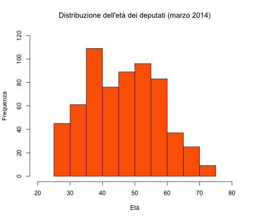

# Distribuzione

Calcoliamo la distribuzione dell'età dei parlamentari della XVII legislatura al 4 marzo 2014. Un file csv con un'unica colonna con le età di tutti i deputati.


```r
eta <- read.csv("/Users/sergiomac/Documents/Documenti da applicazioni/Github/Dataset/età_camera_20140304.csv", 
    header = TRUE)
```


e questa è l'età:


```r
eta[1:5, ]
```

```
## [1] 26 26 26 26 26
```


Prima vediamo i numeri 


```r
density(eta$eta)
```

```
## 
## Call:
## 	density.default(x = eta$eta)
## 
## Data: eta$eta (630 obs.);	Bandwidth 'bw' = 2.75
## 
##        x              y          
##  Min.   :17.8   Min.   :0.00000  
##  1st Qu.:34.1   1st Qu.:0.00303  
##  Median :50.5   Median :0.01544  
##  Mean   :50.5   Mean   :0.01525  
##  3rd Qu.:66.9   3rd Qu.:0.02681  
##  Max.   :83.2   Max.   :0.03189
```


plotto la distribuzione


```r
plot(hist(eta$eta), main = "Distribuzione dell'età dei deputati (marzo 2014)", 
    xlab = "Età", xlim = range(20:80), ylim = range(0:120), ylab = "Frequenza", 
    col = "#fc6500")
```

  


